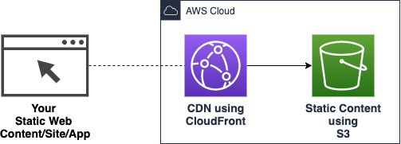

# AWS Serverless based CDN using the AWS-CDK

**WORK IN PROGRESS**

This project tries to implement a simple way to deploy static web content like Single-Page-Applications (SPA) or Static-Websites into the cloud using a AWS S3 bucket and a distribute it via a CDN using AWS CloudFront.


## Intention and conceptual background

Reusable application blocks are already commonplace in many areas of software development. (e.g. UI-Libraries, NPM-Modules, etc.) Only with reusable modules/components is it really possible to beeing productive in application development. But at the moment you still need a lot of special cloud know-how to be able to use the Serverless-Cloud architecture effectively in your own project. This project tries to establish a complete and reusable Serverless-Application-Blocks (also called cloud modules) which you can easily integrate, deploy and use in your own application stack using the AWS-CDK. 

## Architecture and implementation

This project is a reusable AWS-CDK stack implementation that creates a AWS S3 bucket to deploy your static content into it and distribute the content via a CDN using AWS CloudFront.



You can use it in your own AWS-CDK-App like this:

```typescript
#!/usr/bin/env node
import { join } from 'path';
import { App } from '@aws-cdk/core';
import { CdkCdnConstructStack } from 'cdk-cdn-construct';

const app = new App();

// your own stacks ...

new CdkCdnConstructStack(app, 'My-Stack-Name', {
  namespace: `my-app-namespace`,
  env: { account: process.env.CDK_DEFAULT_ACCOUNT, region: process.env.CDK_DEFAULT_REGION },
});

// your own stacks ...
```

TBD

## Setup

`yarn`

## Examples

TBD

**Deploy the examples using AWS-Vault**

`aws-vault exec <your-profile-name> --no-session -- yarn deploy`

## Open tasks / issues

- [ ] publish to NPM 
